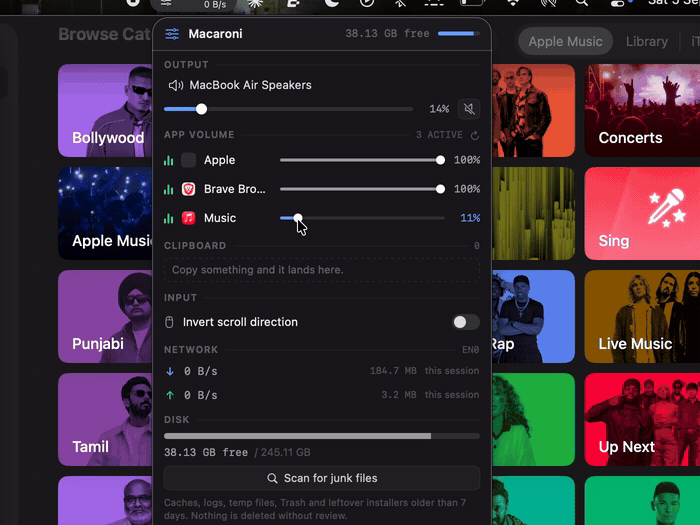

# Macaroni

**Per-app volume control for macOS, plus the small utilities you'd otherwise
install five separate apps for.** Lives in the menu bar. Free and open source.

<!-- Put a screen recording here before publishing — a GIF of the mixer sliders
     moving while two apps play audio. This is the first thing anyone sees, and
     it decides whether they keep reading. Drop it in docs/ and link it:
      -->

## Why

macOS has no way to set the volume of one app. If Spotify is too loud under a
call, your options are "turn Spotify down inside Spotify" or "turn everything
down".

Macaroni fixes that with a real per-app mixer — a slider per app, independent
of everything else — and adds the handful of utilities that otherwise mean
running a clipboard manager, a network monitor and a disk cleaner alongside it.

It is deliberately small. Five features, one file each, no settings window, no
plugin system, no account. The whole thing is a few thousand lines you can read
in an afternoon — which is the point, if you'd rather understand the thing
intercepting your audio than trust it.

If you want the maximal version of this idea, see
[Alternatives](#alternatives) below — there's a very good free one, and it's
worth knowing about before you install this.

## What it does

**App volume** — every app currently playing audio gets its own row and its own
slider. Turn Spotify to 20% while a call stays at 100%. Levels are remembered
per app, so an app you turned down comes back at that level next time it plays.

**Output control** — master volume, mute, and a dropdown to switch output
device (speakers, headphones, AirPods) without opening System Settings.

**Clipboard history** — the last 200 things you copied, in a searchable-by-eye
list. Click to copy again. Copying something already in the list moves it to
the top rather than duplicating it. Memory only — nothing is written to disk.

**Network speed** — live download and upload rates in the menu bar, next to the
icon, whether or not the panel is open.

**Scroll direction** — invert mouse scrolling independently of macOS's Natural
Scrolling setting, so your mouse and trackpad can behave differently.

**Disk cleaner** — finds old caches, logs, temp files, Trash and leftover
`.dmg`/`.pkg` installers, then shows you **exactly what it found**, grouped by
which app it belongs to, with sizes, before deleting anything. Everything
starts unticked. Nothing is ever removed without you selecting it and
confirming.

## Requirements

- macOS 14.4 or later (per-app volume relies on Core Audio process taps, which
  don't exist before 14.4)
- Apple Silicon or Intel

## Install

**Download** the latest `Macaroni.app` from
[Releases](../../releases), move it to `/Applications`, and open it.

The app isn't notarized (that needs a paid Apple Developer account), so the
first launch needs **right-click → Open** instead of a double-click. macOS will
warn you about an unidentified developer; that's expected for open-source apps
distributed outside the App Store.

**Or build it yourself** — you only need the Xcode Command Line Tools
(`xcode-select --install`), not full Xcode:

```bash
git clone https://github.com/HirdyanshuSinghChanaria/Macaroni.git
cd Macaroni
./build-app.sh
open Macaroni.app
```

## Permissions

- **Audio recording** — required for per-app volume. Core Audio taps are
  classified as recording, even though Macaroni never records anything; it
  reads an app's audio, applies your volume, and plays it straight back out.
- **Accessibility** — required only for scroll inversion, since intercepting
  scroll events needs it.

Nothing else needs permission. The disk cleaner only touches your own
`~/Library` caches, never system files or other apps' sandboxed data.

## How it works

The interesting part is per-app volume, because macOS has no API for it.

1. When you move an app's slider below 100%, Macaroni creates a **Core Audio
   process tap** on that app with `muteBehavior = .mutedWhenTapped`. The app's
   own audio stops reaching your speakers and arrives in our tap instead.
2. That tap is combined with your real output device into a private **aggregate
   device**.
3. An IOProc on that device multiplies every sample by your slider value and
   writes the result to the real output — handling any sample-rate or channel
   mismatch between the tap and the device along the way.

The net effect is that one app is quieter and nothing else is touched. Apps
left at 100% are never tapped at all, so audio only detours through Macaroni
when you've actually changed something.

Network speed comes from the kernel's own per-interface byte counters via
`sysctl(NET_RT_IFLIST2)` — the same source `netstat -ib` uses — sampled once a
second. It generates no traffic of its own.

## Known limitations

- **Bluetooth headsets during calls.** Tapping audio makes Macaroni a
  recording client, which can cause macOS to switch a Bluetooth headset into
  its low-quality hands-free profile. Per-app volume on Bluetooth during a call
  may sound worse as a result. Under investigation.
- **macOS ducks other audio during calls** and Macaroni can't prevent it —
  that happens after our part of the audio path.
- Clipboard history is text only, and is lost when the app quits.
- The interface is dark only; it doesn't follow macOS light mode.

## Alternatives

Worth knowing about, honestly:

- **[Vorssaint](https://github.com/vorssaint/vorssaint-utils)** — free, open
  source, and does far more: per-app volume *and* per-app output routing,
  window management, system monitoring, snippets, and plenty else. Signed,
  notarized, installable via Homebrew. If you want one app that does
  everything, install that one instead. Macaroni is Intel-friendly and much
  smaller; Vorssaint is Apple Silicon only but vastly more capable.
- **[SoundSource](https://rogueamoeba.com/soundsource/)** — $47, commercial,
  and the most polished per-app audio tool on macOS. Worth the money if audio
  routing is central to your work.

## License

MIT — see [LICENSE](LICENSE).
